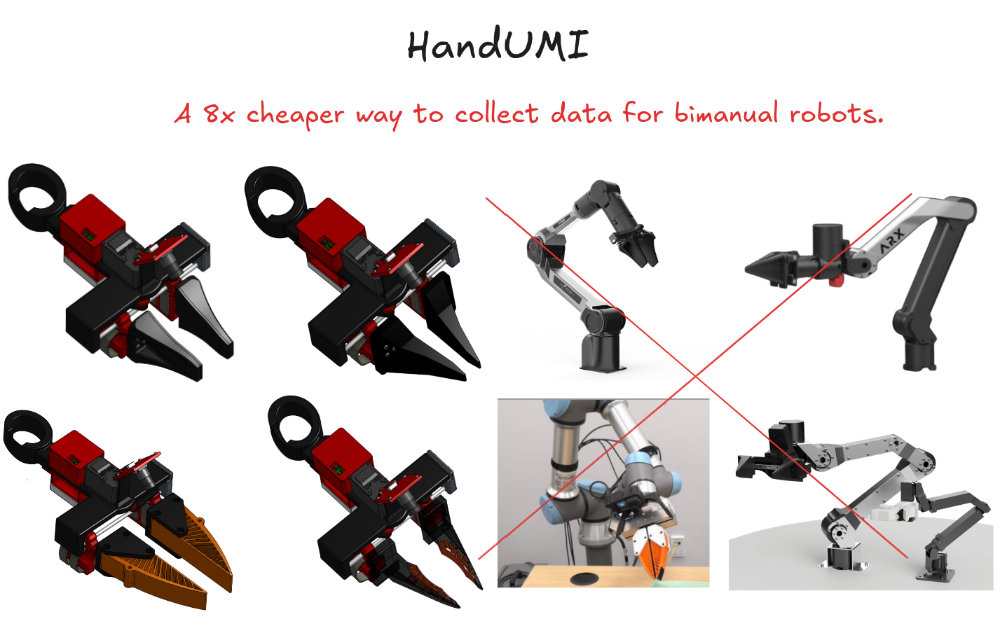

# HandUMI

A hand-worn, open-source variant of the Universal Manipulation Interface (UMI)
for collecting bimanual manipulation data without a robot in the loop, designed
for robot arms with parallel grippers. HandUMI mounts on the operator's thumb
and index/middle fingers, opens and closes with a natural pinch, and uses
interchangeable gripper tips to target different parallel-jaw robot grippers.
One unit costs roughly $110 in parts, plus the VR headset of the user's
preference (PICO 4 Ultra or Meta Quest 3).

  
  

## Quick Links

- [Hardware](hardware/README.md)
- [STL files](hardware/STL/)
- [Bill of Materials](bom/README.md)
- [Software](software/README.md)

## What It Records

Each demonstration records the core signals needed for later deployment:

- SE(3) wrist pose from a VR headset (PICO 4 Ultra or Meta Quest 3) and wrist
  trackers.
- Gripper width from a Feetech servo encoder.
- Wrist-view video from a small camera mounted on the device.

## Why This Form Factor

Traditional leader-follower teleoperation setups need robot arms, a support
frame, synchronized hardware, and a fixed lab environment. HandUMI moves the
collection interface onto the operator's hand, so demonstrations can be captured
directly from human motion.

  

## Direct Gripper-Width Sensing

Most UMI-style rigs estimate gripper aperture indirectly from fiducials or image
segmentation. HandUMI measures aperture directly with a Feetech servo encoder,
so the recorded width follows the mechanical opening frame by frame.

## Motion Tracking

Pose comes from a VR headset and two wrist trackers. Depending on the user's
preference, the headset can be a PICO 4 Ultra or a Meta Quest 3. The headset
provides the world frame, while the wrist trackers provide each hand trajectory.
Each HandUMI includes a printed controller/tracker support (the
`controller_support` parts in `hardware/STL/left_handumi/` and
`hardware/STL/right_handumi/`) that mounts the tracker on the wrist.
This avoids an offline camera SLAM step and keeps the wrist camera focused on
visual observation.

## Wrist-View Camera

The wrist camera provides the observation used during training and deployment.
HandUMI uses the fisheye USB camera listed in the
[Bill of Materials](bom/README.md), a compact UVC module with a wide field of
view.

## Hand-Fit Design

The finger cradle geometry was designed from a 3D scan of the operator's hand.
That scan is used as a CAD reference surface for the thumb and index/middle
finger rings, and
the same workflow can be repeated to fit another operator.

  

## Modular Gripper Tips

The body, camera mount, servo, and tracker mounting stay the same. To target a
new robot, only the detachable gripper tip changes. Current target tips are
AgileX Piper, ARX X5 2023, Dream Gripper (TRLC), Trossen WidowX AI, and the
original UMI gripper.

Any robot with a comparable parallel-jaw gripper can be supported by designing
and printing a matching tip.

## Bill of Materials

The full bill of materials is available in [`bom/README.md`](bom/README.md).
It lists every part needed to build one HandUMI unit — mechanical, structural,
and electronic — with purchase links (Amazon and Alibaba) and per-unit prices.
One unit comes to roughly $110 in parts; a bimanual pair to roughly $221. The
VR headset used for the shared tracking layer is a separate one-time purchase.

## Status

Open-source release in progress.

## References

UMI pioneered in-the-wild data collection without a robot in the loop, and
YUBI brought that idea to a finger-driven V-shaped gripper. HandUMI covers the
piece neither of them does: hand-worn data collection for robot arms with
parallel grippers.

- Cheng Chi, Zhenjia Xu, Chuer Pan, Eric Cousineau, Benjamin Burchfiel, Siyuan
  Feng, Russ Tedrake, and Shuran Song. "Universal Manipulation Interface:
  In-The-Wild Robot Teaching Without In-The-Wild Robots." *Robotics: Science
  and Systems (RSS)*, 2024. [https://umi-gripper.github.io/](https://umi-gripper.github.io/)
- Takehiko Ohkawa, Jumpei Arima, Yuki Noguchi, et al. "YUBI: Yielding
  Universal Bidigital Interface for Bimanual Dexterous Manipulation at Scale."
  *arXiv:2606.10244*, 2026. [https://yubi.airoa.io/](https://yubi.airoa.io/)
