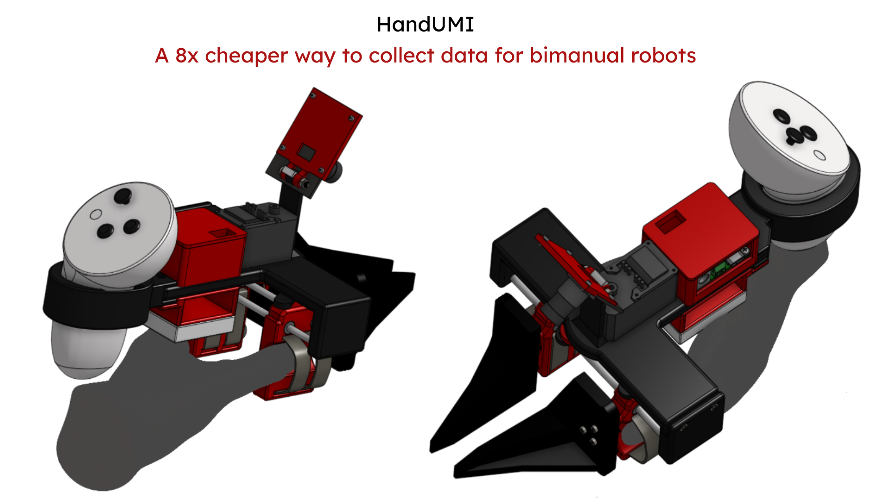
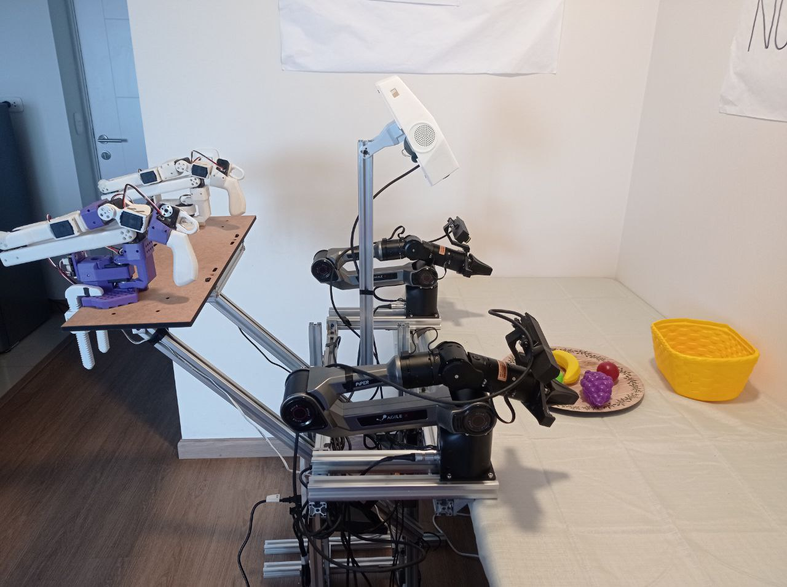
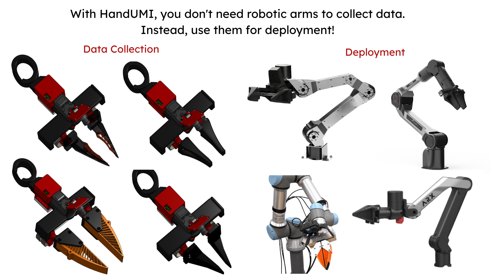
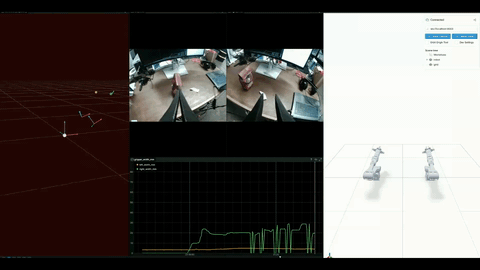
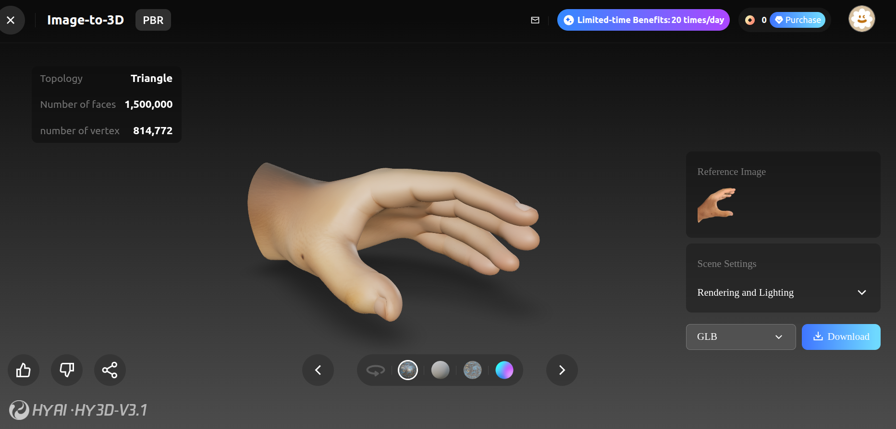

# HandUMI

  

  

A hand-worn, open-source variant of the Universal Manipulation Interface (UMI)
for collecting bimanual manipulation data without a robot in the loop, designed
for robot arms with parallel grippers. HandUMI mounts on the operator's thumb
and index/middle fingers, opens and closes with a natural pinch, and uses
interchangeable gripper tips to target different parallel-jaw robot grippers.
One unit costs roughly $110 in parts, plus the VR headset of the user's
preference (PICO 4 Ultra or Meta Quest 3).

## Why Teleoperation Is Not Scalable?

Traditional leader-follower teleoperation is expensive and lab-constrained.

It is expensive because collecting data for bimanual arms requires at least
four robotic arms: two follower arms plus two leader arms, or a VR
headset acting as the leader for both. Even low-cost leader arms like
[GELLO](https://wuphilipp.github.io/gello_site/), which replicate the
follower's kinematics in 3D-printed hardware to cut the leader cost to a few
hundred dollars each, still leave you duplicating both follower arms for
every operator who wants to collect data.

It is lab-constrained because the follower arm has to physically move to
wherever the data needs to be collected. Bolting an arm to a cart and hauling
it between rooms, buildings, or the environments you actually want to collect
data in is slow, heavy, and hard to scale beyond a single fixed setup.

I felt this pain firsthand: the NONHUMAN team and I collected over 2,000
episodes using this method
([link](https://huggingface.co/spaces/lerobot/visualize_dataset?path=%2FAutobrik%2Fbi_piper_pick_and_place_fruits_mantra%2Fepisode_0)).

  

## Why HandUMI

HandUMI removes both the cost and the lab constraint by moving the collection
interface onto the operator's hand instead of onto a robot, the same way the
original UMI removed the lab constraint for its own gripper. This time, that
wearable concept is adapted from [Generalist](https://generalistai.com/)'s
approach and re-targeted at robot arms with parallel-jaw grippers, and it is
open-source and modular: the body, camera mount, servo, and tracker mounting
stay the same across robots, and only the detachable gripper tip changes to
target a new one. Demonstrations can then be captured directly from human
motion, anywhere, without a robot arm at all. Current target tips are AgileX
Piper, ARX X5 2023, Dream Gripper (TRLC), Trossen WidowX AI, and the original
UMI gripper.

Any robot with a comparable parallel-jaw gripper can be supported by designing
and printing a matching tip.

  

## What It Records

Each demonstration records the core signals needed for later deployment:

- SE(3) wrist pose from a VR headset (PICO 4 Ultra or Meta Quest 3) and its
  controllers.
- Gripper width from a Feetech servo encoder.
- Wrist-view video from a small camera mounted on the device.

## Direct Gripper-Width Sensing

Most UMI-style rigs estimate gripper aperture indirectly from fiducials or image
segmentation. HandUMI measures aperture directly with a Feetech servo encoder,
so the recorded width follows the mechanical opening frame by frame.

## Motion Tracking

Pose comes from a VR headset and its two controllers. Depending on the user's
preference, the headset can be a PICO 4 Ultra or a Meta Quest 3. The headset
provides the world frame, while the controllers provide each hand trajectory.
Each HandUMI includes a printed controller support (the
`controller_support` parts in `hardware/STL/left_handumi/` and
`hardware/STL/right_handumi/`) that mounts the controller on the wrist.
This avoids an offline camera SLAM step and keeps the wrist camera focused on
visual observation.

## Wrist-View Camera

The wrist camera provides the observation used during training and deployment.
HandUMI uses the fisheye USB camera listed in the
[Bill of Materials](bom/README.md), a compact UVC module with a wide field of
view.

## Demo

  

### Additional Example

Natural pinch control makes fine-motor tasks tractable that are notoriously
hard to teleoperate with leader-follower puppeteering rigs. Below, an operator
plugs a USB-C cable into a keyboard, a precision insertion task that benefits
directly from direct human dexterity rather than an intermediary robot arm.

  

## Bill of Materials

The full bill of materials is available in [`bom/README.md`](bom/README.md).
It lists every part needed to build one HandUMI unit — mechanical, structural,
and electronic — with purchase links (Amazon and Alibaba) and per-unit prices.
One unit comes to roughly $110 in parts; a bimanual pair to roughly $221. The
VR headset used for the shared tracking layer is a separate one-time purchase.

## Quick Links

- [Hardware](hardware/README.md)
- [STL files](hardware/STL/)
- [Bill of Materials](bom/README.md)
- [Software](software/README.md)

## Hand-Fit Design

The finger cradle geometry was designed from a 3D scan of the operator's hand.
That scan is used as a CAD reference surface for the thumb and index/middle
finger rings, and
the same workflow can be repeated to fit another operator.

  

## References

UMI pioneered in-the-wild data collection without a robot in the loop, and
YUBI brought that idea to a finger-driven V-shaped gripper.
[Generalist](https://generalistai.com/) built a proprietary hand-worn device
for a V-shaped gripper too. HandUMI is the open-source counterpart for robot
arms with parallel-jaw grippers.

- Cheng Chi, Zhenjia Xu, Chuer Pan, Eric Cousineau, Benjamin Burchfiel, Siyuan
  Feng, Russ Tedrake, and Shuran Song. "Universal Manipulation Interface:
  In-The-Wild Robot Teaching Without In-The-Wild Robots." *Robotics: Science
  and Systems (RSS)*, 2024. [https://umi-gripper.github.io/](https://umi-gripper.github.io/)
- Takehiko Ohkawa, Jumpei Arima, Yuki Noguchi, et al. "YUBI: Yielding
  Universal Bidigital Interface for Bimanual Dexterous Manipulation at Scale."
  *arXiv:2606.10244*, 2026. [https://yubi.airoa.io/](https://yubi.airoa.io/)

## Contributing

This project is under active development, and contributions are welcome. Feel
free to open an issue or a pull request for bugs, improvements, or new gripper
tips, or to open an issue just to ask a question about the hardware or
software.

This field still has plenty of unsolved problems, and I'm confident the
open-source community can contribute a great deal toward getting robots to do
tasks we currently think are impossible for them.
