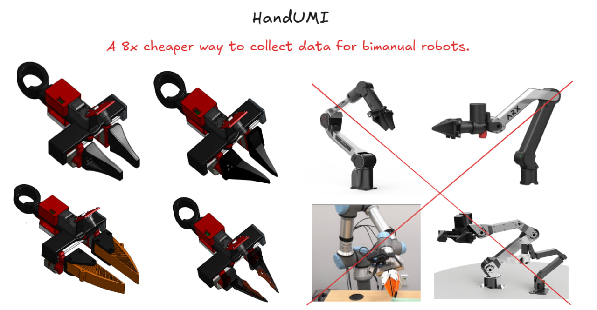
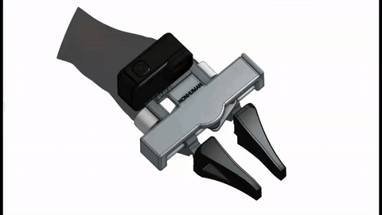

# HandUMI

A hand-worn, open-source variant of the Universal Manipulation Interface (UMI)
for collecting bimanual manipulation data without a robot in the loop, designed
for robot arms with parallel grippers. HandUMI mounts on the operator's thumb
and index finger, opens and closes with a natural pinch, and uses
interchangeable gripper tips to target different parallel-jaw robot grippers.

  

  

## Quick Links

- [Hardware](hardware/README.md)
- [STL files](hardware/stl/)
- [Bill of Materials](bom/README.md)
- [Software](software/README.md)

## What It Records

Each demonstration records the core signals needed for later deployment:

- SE(3) wrist pose from a PICO 4 Ultra headset and wrist trackers.
- Gripper width from a Feetech servo encoder.
- Wrist-view video from a small camera mounted on the device.

## Why This Form Factor

Traditional leader-follower teleoperation setups need robot arms, a support
frame, synchronized hardware, and a fixed lab environment. HandUMI moves the
collection interface onto the operator's hand, so demonstrations can be captured
directly from human motion.

  

## Direct Gripper-Width Sensing

Most UMI-style rigs estimate gripper aperture indirectly from fiducials or image
segmentation. HandUMI measures aperture directly with a Feetech servo encoder,
so the recorded width follows the mechanical opening frame by frame.

## Motion Tracking

Pose comes from a PICO 4 Ultra headset and two wrist trackers. The headset
provides the world frame, while the wrist trackers provide each hand trajectory.
This avoids an offline camera SLAM step and keeps the wrist camera focused on
visual observation.

## Wrist-View Camera

The wrist camera provides the observation used during training and deployment.
The reference camera class is a compact 32 x 32 mm 1080p UVC module with a wide
angle lens. A GoPro or Insta360 body can be used when a different viewpoint or
360-degree capture is needed.

## Hand-Fit Design

The finger cradle geometry was designed from a 3D scan of the operator's hand.
That scan is used as a CAD reference surface for the thumb and index rings, and
the same workflow can be repeated to fit another operator.

  

## Modular Gripper Tips

The body, camera mount, servo, and tracker mounting stay the same. To target a
new robot, only the detachable gripper tip changes. Current target tips are ARX,
Trossen, and TRLC-DK1.

Any robot with a comparable parallel-jaw gripper can be supported by designing
and printing a matching tip.

## Status

Open-source release in progress.

## Related Work

- [Universal Manipulation Interface (UMI)](https://umi-gripper.github.io/)
- [DexUMI](https://dex-umi.github.io/)
